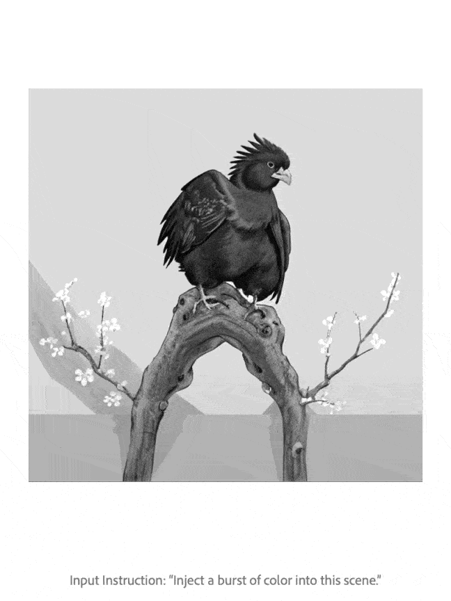

<p align="center">
  
</p>

<h1 align="center">PromptFix: You Prompt and We Fix the Photo</h1>
<h3 align="center">NeurIPS 2024</h3>

<p align="center">
  <a href="https://arxiv.org/pdf/2405.16785"></a>
  &nbsp;
  <a href="/"></a>
  &nbsp;
  <a href="https://huggingface.co/datasets/yeates/PromptfixData"></a>
</p>

---

This repository provides the official PyTorch implementation of **PromptFix**, including pre-trained weights, training and inference code, and our curated dataset used for training.

📢 **PromptFix** is designed to follow human instructions to process degraded images and remove unwanted elements. It supports a wide range of tasks, such as:

- 🎨 **Colorization**
- 🧹 **Object Removal**
- 🌫️ **Dehazing**
- 💨 **Deblurring**
- 🖼️ **Watermark Removal**
- ❄️ **Snow Removal**
- 🌙 **Low-light Enhancement**

Built on a diffusion model backbone, PromptFix delivers outstanding performance in correcting image defects while preserving the original structure, utilizing a 20-step denoising process. It also generalizes effectively across different aspect ratios.

<p align="center">
  
</p>

<p align="center">
  
</p>

## Table of Contents

- [Environment Setup](#-environment-setup)
- [Inference](#-inference)
- [Download Dataset](#-download-dataset)
  - [Dataset Composition](#-dataset-composition)
- [🧑‍💻 Training](#-training)
- [📝 Citing PromptFix](#-citing-promptfix)
- [🙏 Acknowledgments](#-acknowledgments)
- [⚠️ Disclaimer](#-disclaimer)

## Environment Setup

Follow the steps below to clone the repository, set up the environment, and install dependencies. The code is tested on **Python 3.10**.

```bash
git clone https://github.com/yeates/PromptFix.git
cd PromptFix
conda create -n promptfix python=3.10 -y
conda activate promptfix
pip install -r requirements.txt
```

## Inference

To process the default image examples, run the following command. The pre-trained model weights will be automatically downloaded from Hugging Face and placed under the `checkpoints/` directory:

```bash
bash scripts/inference.sh
```

## Download Dataset

We curated a [training dataset](https://huggingface.co/datasets/yeates/PromptfixData) exceeding **1 million** samples. Each sample includes paired images and instruction and auxiliary text prompts. The dataset covers multiple low-level image processing tasks.

To download the dataset, run the following commands at the project root directory:

```bash
bash scripts/download_promptfix_dataset.sh
```

### Dataset Composition

The dataset includes the following tasks:

| Task                      | Percentage |
|---------------------------|------------|
| 🎨 **Colorization**           | 29.3%      |
| 🌙 **Low-light Enhancement**  | 20.7%      |
| 🖼️ **Watermark Removal**      | 12.4%      |
| 🧹 **Object Removal**         | 11.9%      |
| ❄️ **Snow Removal**           | 9.7%       |
| 🌫️ **Dehazing**               | 8.9%       |
| 💨 **Deblurring**             | 7.1%       |
| **Total**                  | **100%**   |

**Note:** The dataset is packaged into Parquet files, consisting of 100 parts. Each part can be loaded independently. If you want to experiment with a smaller amount of data without downloading the entire dataset, you can download only a few Parquet files.

## 🧑‍💻 Training

To train the model, run:

```bash
bash scripts/train.sh <GPU_NUMS>
```

Replace `<GPU_NUMS>` with the number of GPUs you wish to use.

Once checkpoints are saved, you need to convert the EMA (Exponential Moving Average) format weights into a loadable checkpoint:

```bash
python scripts/convert_ckpt.py --ema-ckpt <EMA_CKPT_PATH> --out-ckpt <OUT_CKPT_PATH>
```

For example:

```bash
python scripts/convert_ckpt.py --ema-ckpt ./train_logs/promptfix/checkpoints/ckpt_epoch_0/state.pth --out-ckpt ./checkpoints/promptfix_epoch_1.ckpt
```

## 📝 Citing PromptFix

If you use our dataset or code, please give the repository a star ⭐ and cite our paper:

```bibtex
@inproceedings{yu2024promptfix,
  title={PromptFix: You Prompt and We Fix the Photo},
  author={Yu, Yongsheng and Zeng, Ziyun and Hua, Hang and Fu, Jianlong and Luo, Jiebo},
  booktitle={NeurIPS},
  year={2024}
}
```

## 🙏 Acknowledgments

We would like to thank the authors of [InstructDiffusion](https://github.com/cientgu/InstructDiffusion), [Stable Diffusion](https://github.com/CompVis/stable-diffusion), and [InstructPix2Pix](https://github.com/timothybrooks/instruct-pix2pix) for sharing their codes.

## ⚠️ Disclaimer

This repository is part of an open-source research initiative provided for academic and research purposes only. We have not established any official commercial services, products, or web applications related to this project. Use this software at your own risk; it may not meet all your expectations or requirements.

Please note that the PromptFix dataset is curated from open-source research projects and publicly available photo libraries. By using our dataset, you automatically agree to comply with all applicable licenses and terms of use associated with the source data. Furthermore, you acknowledge and agree that neither the dataset nor any models trained using it may be utilized for any commercial purposes.
